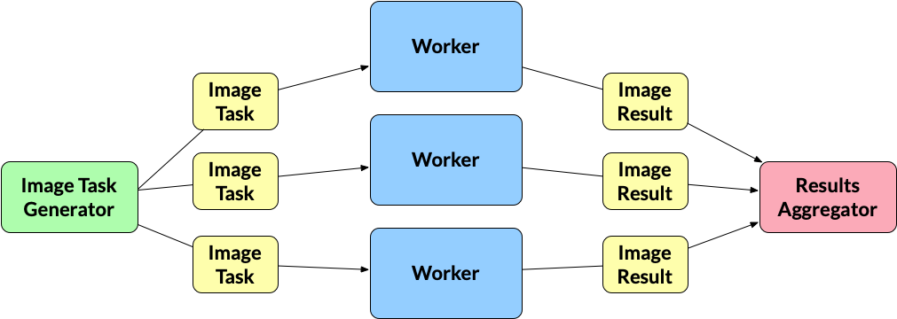
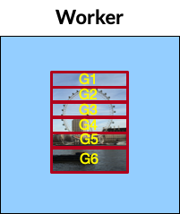

# An Image Processing System

## Image Processing System
For this, we will create image editor that will apply image effects
on series of images using 2D image convolution. Please make sure to read
over the articles presented in the Preliminaries section before
beginning the assignment. Similar to project \#1, The program will read
in from a series of JSON strings, where each string represents an image
along with the effects that should be applied to that image. Each string
will have the following format,

``` json
{ 
  "inPath": string, 
  "outPath": string, 
  "effects": [string] 
}
```

For example, processing an image of a sky may have the following JSON
string,

``` json
{ 
  "inPath": "sky.png", 
  "outPath": "sky_out.png",  
  "effects": ["S","B","E"]
}
```

where each key-value is described in the table below,

| Key-Value                     | Description                                                                                                                                                                                                                      |
| ----------------------------- | -------------------------------------------------------------------------------------------------------------------------------------------------------------------------------------------------------------------------------- |
| ``"inPath":"sky.png"``        | The ``"inPath"`` pairing represents the file path of the image to read in. Images in  this assignment will always be PNG files. All images are relative to the ``data`` directory inside the ``proj2`` folder.                   |
| ``"outPath:":"sky_out.png"``  | The ``"outPath"`` pairing represents the file path to save the image after applying the effects. All images are relative to the ``data`` directory inside the ``proj2`` folder.                                                  |
| ``"effects":["S"\,"B"\,"E"]`` | The ``"effects"`` pairing  represents the image effects to apply to the image. You must apply these in the order they are listed. If no effects are specified (e.g.\, ``[]``) then the out image is the same as the input image. |

The program will read in the images, apply the effects associated with
an image, and save the images to their specified output file paths. How
the program processes this file is described in the **Program
Specifications** section.

### Image Effects

The sharpen, edge-detection, and blur image effects are required to use
image convolution to apply their effects to the input image. Again, you
can read about how to perform image convolution here:

-   [Two Dimensional
    Convolution](http://www.songho.ca/dsp/convolution/convolution2d_example.html)

As stated in the above article, the size of the input and output image
are fixed (i.e., they are the same). Thus, results around the border
pixels will not be fully accurate because you will need to pad zeros
where inputs are not defined. You are required to use the a zero-padding
when working with pixels that are not defined. **You may not use a
library or external source to perform the convolution for you. You must
implement the convolution code yourself**. The grayscale effect uses a
simple algorithm defined below that does not require convolution.

Each effect is identified by a single character that is described below,

| Image Effect | Description                                                                                                                                                                                                                                                                                                |
| ------------ | ---------------------------------------------------------------------------------------------------------------------------------------------------------------------------------------------------------------------------------------------------------------------------------------------------------- |
| ``"S"``      | Performs a sharpen effect with the following kernel (provided as a flat go array): ``[9]float6 {0,-1,0,-1,5,-1,0,-1,0}``.                                                                                                                                                                                  |
| ``"E"``      | Performs an edge detection effect with the following kernel (provided as a flat go array): ``[9]float64{-1,-1,-1,-1,8,-1,-1,-1,-1}``.                                                                                                                                                                      |
| ``"B"``      | Performs a blur effect with the following kernel (provided as a flat go array): ``[9]float64{1 / 9.0, 1 / 9, 1 / 9.0, 1 / 9.0, 1 / 9.0, 1 / 9.0, 1 / 9.0, 1 / 9.0, 1 / 9.0}``.                                                                                                                             |
| ``"G"``      | Performs a grayscale effect on the image. This is done by averaging the values of all three color numbers for a pixel, the red, green and blue, and then replacing them all by that average. So if the three colors were 25, 75 and 250, the average would be 116, and all three numbers would become 116. |

### The `data` Directory

Inside the `proj2` directory, You will need to download the `data`
directory here:

-   [Proj 2
    Data](https://www.dropbox.com/s/cwse3i736ejcxpe/data.zip?dl=0) :
    There should be a download arrow icon on the left side to download
    the zip folder.

Place this directory inside the `proj2` directory that contains the
subdirectories: `editor` and `png`. **DO NOT COMMIT THIS DIRECTORY TO
YOUR REPOSITORY**. These are very large files and committing this
directory will result in a penalty!

Here is the structure of the `data` directory:

| Directory/Files        | Description                                                                                                                                                                                                                                                                                                                                                                                                                                                                                                                                                                                                                                                                    |
| ---------------------- | ------------------------------------------------------------------------------------------------------------------------------------------------------------------------------------------------------------------------------------------------------------------------------------------------------------------------------------------------------------------------------------------------------------------------------------------------------------------------------------------------------------------------------------------------------------------------------------------------------------------------------------------------------------------------------ |
| ``effects.txt``        | This is the file that contains the string of JSONS that were described above. This will be the only file used for this program (and also for testing purposes). You must use a relative path to your ``proj2`` directory to open this file. For example, if you open this file from the ``editor.go`` file then you should open as ``../data/effects.txt``.                                                                                                                                                                                                                                                                                                                    |
| ``expected`` directory | This directory contains the expected filtered out image for each JSON string provided in the ``effects.txt``. We will only test your program against the images provided in this directory. Your  produced images do not need to look 100% like the provided output. If there are some slight differences based on rounding-error then that's fine for full credit.                                                                                                                                                                                                                                                                                                            |
| ``in`` directory       | This directory contains three subdirectories called: ``big``, ``mixture``, and ``small``. The actual images in each of these subdirectories are all the same, with the exception of their *image sizes*. The ``big`` directory has the best resolution of the images, ``small`` has a reduced resolution of the images, and the ``mixture`` directory has a mixture of both big and small sizes for different images. You must use a relative path to your ``proj2`` directory to open this file. For example, if you want to open the ``IMG_2029.png`` from the ``big`` directory from inside the ``editor.go`` file then you should open as ``../data/in/big/IMG_2029.png``. |
| ``out`` directory      | This is where you will place the ``outPath`` images when running the program.                                                                                                                                                                                                                                                                                                                                                                                                                                                                                                                                                                                                  |

### Working with Images in Go and Startup Code

As part of the Go standard library, an `image` package is provided that
makes it easy to load,read,and save PNG images. I recommend looking at
the examples from these links:

-   [Go PNG docs](https://golang.org/pkg/image/png/)
-   A [helpful
    tutorial](https://www.devdungeon.com/content/working-images-go) for
    working on png images. Make sure to cite this website, if you are
    going to use a similar structure to the code provided. The developer
    directly accesses the `Pix` buffer. I would recommend you use the
    `At()` and `Set()` methods as specified by the Go PNG documentation.

``` go
type Image struct {
  in  *image.RGBA64  // Think about swapping these between effects 
  out *image.RGBA64  // Think about swapping these between effects 
  Bounds  image.Rectangle
  ... 
} 
```

You may want to rename this to `ImageTask` since you'll be using that
name later on in your parallel implementation. Remember these are
**pointers** so you only need to swap the pointers to make the old out
buffer the new in buffer when applying one effect after another effect.
This process is less expensive than copying pixel data after apply each
effect.

To help you get started, I provide code for loading, saving, performing
the grayscale effect on a png image. You are not required to use this
code and you can modify it as you wish. This code is already inside the
`proj2/sample/sample.go` directory. You can run this sample program by
going into the `proj2/sample` directory typing in the following command:

    $: go run sample.go test_img.png 

### Program Specifications

For this project, You will implement three versions of this image
processing system. The versions will include a sequential version and
two parallel versions.

The running of these various versions have already been setup for you
inside the `proj2/editor/editor.go` file. The program has the following
usage statement:

    Usage: editor data_dir [mode] [number_of_threads]
    data_dir = The data directories to use to load the images.
    mode     = (bsp) run the BSP mode, (pipeline) run the pipeline mode
    number_of_threads = Runs the parallel version of the program with the specified number of threads (i.e., goroutines).

The `data_dir` argument will always be either `big`, `small`, or
`mixture` or a combination between them. The program will always read
from the `data/effects.txt` file; however, the `data_dir` argument
specifies which directory to use. The user can also add a `+` to perform
the effects on multiple directories. For example, `big` will apply the
`effects.txt` file on the images coming from the `big` directory. The
argument `big+small` will apply the `effects.txt` file on both the `big`
and `small` directory. The program must always prepend the `data_dir`
identifier to the beginning of the `outPath`. For example, running the
program as follows:

    $: go run editor.go big bsp 4 

will produce inside the `out` directory the following files:

    big_IMG_2020_Out.png 
    big_IMG_2724_Out.png 
    big_IMG_3695_Out.png 
    big_IMG_3696_Out.png 
    big_IMG_3996_Out.png 
    big_IMG_4061_Out.png 
    big_IMG_4065_Out.png
    big_IMG_4066_Out.png 
    big_IMG_4067_Out.png
    big_IMG_4069_Out.png

Here's an example of a combination run:

    $: go run editor.go big+small pipeline 2

will produce inside the `out` directory the following files:

    big_IMG_2020_Out.png 
    big_IMG_2724_Out.png 
    big_IMG_3695_Out.png 
    big_IMG_3696_Out.png 
    big_IMG_3996_Out.png 
    big_IMG_4061_Out.png 
    big_IMG_4065_Out.png
    big_IMG_4066_Out.png 
    big_IMG_4067_Out.png
    big_IMG_4069_Out.png
    small_IMG_2020_Out.png 
    small_IMG_2724_Out.png 
    small_IMG_3695_Out.png 
    small_IMG_3696_Out.png 
    small_IMG_3996_Out.png 
    small_IMG_4061_Out.png 
    small_IMG_4065_Out.png
    small_IMG_4066_Out.png 
    small_IMG_4067_Out.png
    small_IMG_4069_Out.png

We will always provide valid command line arguments so you will only be
given at most 3 specified identifiers for the `data_dir` argument. A
single `+` will always be used to separate the identifiers with no
whitespace.

The `mode` and `number_of_threads` arguments will be used to run one of
the parallel versions. Parts 2 and 3 will discuss these arguments in
more detail. If the `mode` and `number_of_threads` arguments are not
provided then the program will default to running the sequential
version, which is discussed in Part 1.

The scheduling (i.e., running) of the various implementations is handled
by the `scheduler` package defined in `proj2/scheduler` directory. The
`editor.go` program will create a configuration object (similar to
project 1) using the following struct:

``` go
type Config struct {
  DataDirs string //Represents the data directories to use to load the images.
  Mode     string // Represents which scheduler scheme to use
  // If Mode == "s" run the sequential version
  // If Mode == "pipeline" run the pipeline version
  // If Mode == "bsp" run the pipeline version
  // These are the only values for Version
  ThreadCount int // Runs the parallel version of the program with the
  // specified number of threads (i.e., goroutines)
}
```

The `Schedule` function inside the `proj2/scheduler/scheduler.go` file
will then call the correct version to run based on the `Mode` field of
the configuration value. Each of the functions to begin running the
various implementation will be explained in the following sections.
**You cannot modify any of the code in the
\`\`proj2/scheduler/scheduler.go\`\` or \`\`proj2/editor/editor.go\`\`
file**.

**Additional Assumptions**: No error checking is needed to be done to
the strings coming in from *effects.txt*. You can assume the JSON
strings will contain valid values and provided in the format described
above. We will always provide the correct command line arguments and in
the correct order. The `expected` directory in `proj2/data` is based on
only running the small dataset. Thus, the resolution for mixture and big
modes will make the images appear slightly different. This is okay for
this assignment. We will always run/grade your solutions by going inside
the `proj2/editor` directory so loading in files should be relative to
that directory.

## Part 1: Sequential Implementation

Inside the `proj2/scheduler/sequential.go` file, implement the function:

``` go
func RunSequential(config Config) {

}
```

The sequential version is ran by default when executing the `editor`
program when the `mode` and `number_of_threads` are both not provided.
The sequential program is relatively straightforward. This version
should run through the images specified by the strings coming in from
`effects.txt`, apply their effects and save the modified images to their
output files inside the `data/out` directory. Make sure to prepend the
`data_dir` identifier.

> **Note**:
> You should implement the sequential version first. Make sure your code
> is **modular** enough such that you can potentially reuse functions/data
> structures later in your parallel version. Think about what libraries
> should be created (e.g., feed and lock libraries you created for project
> 1). **We will be looking at code and design style more closely when
> grading this assignment**.

You may find this code useful:

``` go
effectsPathFile := fmt.Sprintf("../data/effects.txt")
effectsFile, _ := os.Open(effectsPathFile)
reader := json.NewDecoder(effectsFile)
```

## Part 2: Fan-Out Implementation

The first parallel implementation will use channels and must be
implemented as follows:

1.  For this version, all synchronization between the goroutines must be
    done using channels. **You cannot use anything from the \`\`sync\`\`
    package for this implementation that includes the
    \`\`sync.Waitgroup\`\`** object. You'll need to think about how to
    implement a `sync.Waitgroup`object using channels.

2.  You must implement the following **fan-in/fan-out** scheme. Since this was only briefly mentioned during class,
you may want to look at the week 6 example codes as a reminder.

    

    -   **Image Task Generator**: As stated earlier, the program will
        read in the images to process via `effects.txt`. Reading is done
        by a single generator goroutine. The image task generator will
        read in the JSON strings and do any preparation needed before
        applying their effects. What "preparation" means is dependent on
        your implementation and how you plan to pass the images to the
        worker goroutines (described below), which handle the filtering.
        The output from this goroutine will be an `ImageTask` value. How
        you define the `ImageTask` struct is up to you. The image task
        generator will write each `ImageTask` to a channel and multiple
        workers will read from it.

    -   **ImageTask**: A value that holds everything needed to do
        filtering for a specific JSON string. Again, its up to you how
        you define the `ImageTask` struct.

    -   **Workers**: The workers are the goroutines that are performing
        the filtering effects on the images. The number of workers is
        static and is equal to the `number_of_threads` command line
        argument. A worker must use a pipeline pattern. The pattern
        **must** model the pipeline implemented in
        `m6/discussion/patterns/fan-out-fan-in/fig-fan-out-naive-prime-finder.go`.
        You must determine how to reshape the code provided in that file
        into the pipeline you are building in this project. Each
        `Worker` of the pipeline, must have an internal *data
        decomposition* component, which must do the following:

        -   Spawn `N` number of goroutines, where
            `N = number_of_threads`. We will call these "mini-workers".
        -   Each mini-worker goroutine is given a section of the image
            to work on.
        -   Each mini-worker goroutine will apply the effect for that
            stage to its assigned section.
        -   You should give approximately equal portions to all
            mini-workers.

        Visually the splitting could look something like this if
        `number_of_threads=6`:

        

        This means that if there will be a total of 6 `Workers` with
        each having 6 mini-workers running, which totals to 36 "worker"
        goroutines running in parallel. One question you may have is
        "should the worker be spawning N new mini-workers for each
        effect, or should it spawn N new mini-workers once when it gets
        an image and reuse those same goroutines at each stage of the
        pipeline for that image?" You can do either in this specific
        case. However, I recommend that you spawn new ones because it's
        easier to manage.

        The output of a worker is an `ImageResult`. This can be same as
        an `ImageTask`. There is no need to create a a new struct that
        represents the final image after applying its effects. However,
        you can define a new `ImageResult` struct that holds that final
        image. Each worker writes its `ImageResult` to a channel that is
        read by a Results Aggregator gorountine (described below).

    -   **ImageResult**: the final image after applying its effects.
        Again you do not need to define a new `ImageResult` struct but
        instead can reuse the same `ImageTask` struct.

    -   **Results Aggregator**: The results aggregator gorountine reads
        from the channel that holds the `ImageResults` and saves the
        filtered image to its `"outPath"` file. Make sure to prepend the
        `data_dir` identifier.

3.  If all the images have been processed then the main goroutine can
    exit the program. You cannot make the main goroutine handle the
    Image Task Generator and/or the Results Aggregator.

4.  The `mode` command line argument value for executing this version is
    `"pipeline"`.

Another way of stating the above breakdown is the following:

-   *X* images to process
-   *P* number of threads (which is supplied by the `number_of_threads`
    flag)
-   *N* workers (*N = P*)

1.  `ImageTaskGenerator` produces *X* `ImageTasks` and dumps them all
    into a channel.
2.  A worker *w1* tries to grab a single `ImageTask` *x1* from the
    channel. This worker is SOLELY responsible for performing all *E*
    effects for this one image.
3.  The worker *w1* splits up this single `ImageTask` *x1* into *P*
    roughly equal portions and spawns *P* goroutines to apply effect
    *e1* to the image. Once all goroutines have applied effect *e1*,
    they can begin applying *e2*, *e3*, ... , until all *E* effects have
    been applied in order.
4.  Meanwhile, other workers *w2*, *w3*, ... all the way up to *N* are
    concurrently grabbing images of their own, and performing step (3)
    on their own images.
5.  If *X \> N*, then a worker *w* will go back up to step (2), grab
    another `ImageTask` *x*, and perform step (3) on it. We repeat this
    process until all *X* images have been processed.

In the `proj2/scheduler/pipeline..go` file, implement this pipeline
algorithm inside the function:

``` go
func RunPipeline(config Config) {

}
```

Make sure to make to think about your function decomposition and not
define everything inside `RunPipeline` function.

## Part 3: BSP Implementation

In the second parallel implementation, you must implement the *bulk
synchronous parallel (BSP)* model technique as follows:

1.  For this version, all synchronization between the goroutines must be
    done using only the `sync` package (i.e, only using
    mutexes,condition variables, or atomics). Channels cannot be used
    for this implementation. **You cannot use \`\`sync.Waitgroup\`\`
    anywhere in this implementation.**

2.  The `Schedule` function inside the `proj2/scheduler/scheduler.go`
    file includes the following code for the BSP implementation,

    ``` go
    ctx := NewBSPContext(config)
    var idx int
    for idx = 0; idx < config.ThreadCount-1; idx++ {
      go RunBSPWorker(idx, ctx)
    }
    RunBSPWorker(idx, ctx)
    ```

    The scheduler first calls the `NewBSPContext` constructor function
    to create and initialize the worker context for the goroutines that
    will be part of the super-steps for the BSP model. Inside the
    `proj2/scheduler/bsp.go` file, you will need to define and implement
    the following:

    ``` go
    type bspWorkerContext struct {
        // Define the necessary fields for your implementation 
    }

    func NewBSPContext(config Config) *bspWorkerContext { 
        //Initialize the context
        return nil 
    }
    ```

    You can decide what to define in this specific context and what
    needs to be initialized in this function. Make sure to include copy
    over any data from the `Config` argument into the context that you
    will need when running the model.

    After initializing the context, the `Schedule` function will spawn
    off `config.ThreadCount-1` goroutines upfront to run `RunBSPWorker`
    that will run the entire BSP model for all images. Inside the
    `proj2/scheduler/bsp.go` file, you need to implement the
    `RunBSPWorker` function:

    ``` go
    func RunBSPWorker(id int, ctx *bspWorkerContext) {
        for {
            // Implement the BSP model here. 
            // No additional loops can be used in this implementation. T
            // This goes to calling other functions. No other called 
            // function you define or are using can have looping being done for you. 
            break 
        }
    }
    ```

    Inside the `RunBSPWorker`, you need to think about what should be
    done at each **super-step** and **global synchronization** point
    inside. You can only use a single infinite for-loop as shown above.
    No other function call can do any additional iteration for you. How
    you decompose the work at each super-step and synchronization point
    is up to you to decide. You have more freedom to express your
    parallel programming abilities in this one so really think about the
    parallel decomposition. The main goroutine is one of the goroutines
    in the BSP model but the `Schedule` handles this requirement for
    you. All spawned goroutines must be doing an equal amount of work
    during a super-step and can only be idle after their work is
    complete. Once all the images have been completed then the
    goroutines should `break` from the loop and exit.

3.  If all the images have been processed then the main goroutine can
    exit the program.

---

## SPEEDUP GRAPHS

- **PIPELINE**
  - 

- **BSP**
  - 

---

## A brief description of the project.

In this project, a set of images needs to be converted into resultant images by applying a list of effects. The effects are stored in a text file, and each image needs to go through each effect in the file.

### Sequential Version:

For every size (small/mixture/large), the effects.txt file is read. Based on the JSON, the image is loaded, and the list of effects is applied. Once the effects are applied, the resultant image is saved in an output path. After all the actions on an image are done, the next image is picked from effects.txt, and the process is repeated.


### Pipeline Version:

In the pipeline version, the task creator puts all the images into a channel. One worker thread works on one image, and it reads the image from the channel. 

After that, the worker thread spawns multiple mini-workers that apply all effects on the bounds assigned to that mini-worker. Here, channels are used to implement wait groups.

Once all the threads are done applying an effect, the image is swapped to be ready for the next effect. This step is important to ensure that all the threads apply the effect before moving on to the next one. 

The filtered image is fed into a channel, and all the images are saved in their output path. Here, wait groups are implemented using channels.

### BSP Version:

In the BSP version, a barrier `barrier.go` is implemented.

The `Run BSP Worker` implementation works differently based on the thread ID. If the ID is the master ID (in our case, ID = threadCount-1), the effects.txt file is read, and all the worker threads including the master will work on one chunk of this image. 

In the BSP version, we also wait until all worker threads have applied one effect on their assigned bounds (bounds are assigned based on the ID) before moving on to the next effect. 

Once all the effects on an image are applied, the image is pushed to an array. The master routine (threadCount-1) will then spawn new threads to save the images. In order to wait for threads, barriers are used.

## Instructions on how to run your testing script.

---

The sbatch script is located in `proj2/benchmark` named `benchmark-proj2.sh`.

The generate_graph.py requires the correct path of benchmark/time.txt (will be generated by the sbatch job) to be provided on line 14

To run the sbatch script, follow these steps:

```
cd proj2/benchmark
sbatch benchmark-proj2.sh
```

The results will be generated in data.txt file inside the `benchmark` folder.

## Explanation of graph results

- What are the hotspots and bottlenecks in your sequential program?

  - The following are the bottlenecks and hotspots in the sequential program:

    - Although the images in the list `effects.txt` are not dependent on each other for actions, we are waiting for one image to finish to start another.
    - Similarly, the rows in the images are not dependent on one another to apply effects, but still, while doing sequentially, we are waiting for one row to finish before moving on to another.
    - While the main go routine is saving, it's waiting for the image to be saved in the file before it can start an operation on another image.

- Which parallel implementation is performing better? Why do you think it is?

    - The BSP with 12 threads is performing the best among all three sequential, pipeline, and BSP. Although the speedup was even higher if I used the maximum possible threads, which is 128 on the Linux cluster.

In both pipeline and BSP, the image is divided into chunks, and each Go routine works on one chunk


